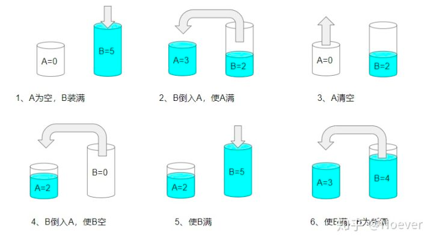

# [Water and Jug Problem][title]

## Solution

第一个例子有点没读懂， 为啥 3，5 能得到 4 的容量， 因为水是无限的，如果在两个水杯腾挪之间， 其中某个水杯能够出现 4 就可以满足条件了， 过程如上图所示

在任意一个时刻，我们可以且仅可以采取以下几种操作：

把 X 壶的水灌进 Y 壶，直至灌满或倒空；
把 Y 壶的水灌进 X 壶，直至灌满或倒空；
把 X 壶灌满；
把 Y 壶灌满；
把 X 壶倒空；
把 Y 壶倒空。
因此，本题可以使用深度优先搜索来解决。搜索中的每一步以 remain_x, remain_y 作为状态，即表示 X 壶和 Y 壶中的水量。在每一步搜索时，我们会依次尝试所有的操作，递归地搜索下去。这可能会导致我们陷入无止境的递归，因此我们还需要使用一个哈希结合（HashSet）存储所有已经搜索过的 remain_x, remain_y 状态，保证每个状态至多只被搜索一次。

```kotlin
class CanMeasureWater {
    fun canMeasureWater(jug1Capacity: Int, jug2Capacity: Int, targetCapacity: Int): Boolean {
        val stack = ArrayDeque<IntArray>()
        val visited = mutableSetOf<Long>()
        stack.add(intArrayOf(0, 0))
        while (stack.isNotEmpty()) {
            if (hash(stack.last()) in visited) {
                stack.removeLast()
                continue
            }
            val cur = stack.removeLast()
            visited.add(hash(cur))
            val (remainX, remainY) = cur
            if (remainX == targetCapacity || remainY == targetCapacity || (remainX + remainY) == targetCapacity) {
                return true
            }
            stack.add(intArrayOf(jug1Capacity, remainY))
            stack.add(intArrayOf(remainX, jug2Capacity))
            stack.add(intArrayOf(0, remainY))
            stack.add(intArrayOf(remainX, 0))
            val pourIntoY = min(remainX, jug2Capacity - remainY)
            stack.add(intArrayOf(remainX - pourIntoY, remainY + pourIntoY))
            val pourIntoX = min(remainY, jug1Capacity - remainX)
            stack.add(intArrayOf(remainX + pourIntoX, remainY - pourIntoX))

        }
        return false
    }

    private fun hash(state: IntArray): Long {
        return 1000001 * state[0].toLong() + state[1]
    }

}
```


## Conclusion

如果你同我一样热爱数据结构、算法、LeetCode，可以关注我 GitHub 上的 LeetCode 题解：[awesome-kotlin-leetcode][akl]


[title]: https://leetcode.cn/problems/employee-free-time/description/?company_slug=google
[akl]: https://github.com/NightXlt/awesome-kotlin-leetcode
